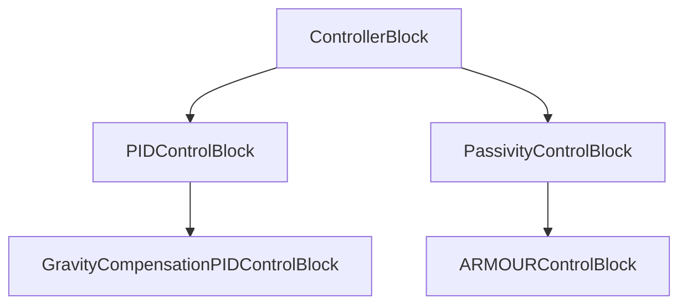

# dynamics

This folder contains our core implementations of different controllers.



## Controller Modules

### ControllerBlock

This is the base class of the controller.
Given an input pack that contains the desired trajectories and the robot states at the current time:

```C++
using VecX = Eigen::VectorXd;
struct InputPack
{
    // desired state
    const VecX& pos_des;
    const VecX& vel_des;
    const VecX& acc_des;

    // actual state
    const VecX& pos;
    const VecX& vel;

    // pos and vel error
    const VecX& e;
    const VecX& ed;

    // time difference between previous update and current update
    double delta_t;
};
```

the controller calls the member function `update` to generate control torque to track the trajectories.

### PIDControlBlock

A naive joint-level PID controller implementation.

### GravityCompensationPIDControlBlock

A naive joint-level PID controller with gravity compensation [1, 6.19].

### PassivityControlBlock

A virtual controller instance that implements the passivity-based control law [1, Section 6.5.3]:

```math
\tau = H(q)\ddot{q}_r + C(q, \dot{q})\dot{q}_r + g(q) + v
```
where
```math
\dot{q}_r = \dot{q}_d + K_r(q_d - q)
```
Here $v$ represents a feedback input to stabilize the tracking performance.
Nearly all robust controllers or adaptive controllers apply this passivity-based control law.
But they have different formulations for $v$.
Thus, `PassivityControlBlock` provides an additional virtual function called `stabilize_input` for users to fill in.

### ARMOURControlBlock

The robust controller introduced in [ARMOUR](https://roahmlab.github.io/armour/) [2], which is a class inherited from `PassivityControlBlock` class.

## References

[1] Siciliano, Bruno, Oussama Khatib, and Torsten Kröger, eds. Springer handbook of robotics. Vol. 200. Berlin: springer, 2008.

[2] Michaux, Jonathan, et al. "Can't Touch This: Real-Time, Safe Motion Planning and Control for Manipulators Under Uncertainty." arXiv preprint arXiv:2301.13308 (2023).